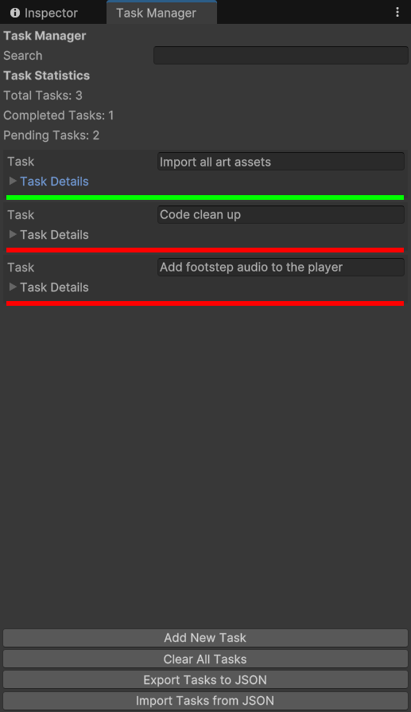

# Unity-Editor-Tasks
Unity Editor Tasks is a utility for Unity that allows developers to manage a list of tasks directly in the editor. Organize your work with categories like Development, Design, Arts, Audio, Bugs, and more.

---
You can download the latest version of the Task Manager Unity Package here:
[Download TaskManager](https://github.com/salvatoresciano/Unity-Editor-Tasks/releases/latest)

---

## **Task Manager: Organization and Efficiency**  
🌟 **The Project**  
The **Task Manager** is designed to simplify project and task management, making it clear, intuitive, and visually appealing. With its modern interface and customizable features, the Task Manager allows users to plan, track, and complete their tasks effectively.

---

### **🛠️ How It Works**  
- **Flexible Structure**: The Task Manager offers a list view, with options to expand each task and view its details.  
- **Modular Code**: Developed in C# for Unity Editor, leveraging an architecture that can adapt to various project needs.  
- **Visual Indicators**: Each task includes a visible status (completed, in progress, overdue), represented by intuitive colors to help users prioritize effectively.  
- **Complete Customization**: Users can add, edit, or delete tasks, assign priorities, categories, and notes, as well as set reminders for upcoming deadlines.  
- **Data Persistence**: Tasks are automatically saved and restored upon reopening, ensuring continuity between sessions.  

---

### **🤔 Why This Project?**  
The Task Manager was created to help developers and project teams:  
1. **Stay organized**: Keep track of tasks with a tool directly integrated into the Unity Editor.  
2. **Optimize workflow**: Through ease of use and immediate visibility of priorities.  
3. **Leverage Unity’s potential**: Showcase how Unity can be used not only for games but also for productivity tools.

---

### **🚀 Key Features**  
- **Color-Coded Visualization**: Each task is marked by a color:  
  - **Green** for completed tasks.  
  - **Red** for overdue tasks.  
  - **Orange** for tasks in progress.  
- **Expandable Structure**: Task details can be shown or hidden as needed.  
- **Separation Lines**: Colored lines between sections enhance readability and aesthetics.  
- **Intuitive Management**: Add, edit, or remove tasks with just a few clicks.  
- **Export/Import Functionality**: Save or load tasks in JSON format for easy sharing.  

---

### **🖼️ Some Screenshots**   

---

### **🚀 Future Goals**  
- **Enhance Visual Design**: Integrate animations for smoother transitions.  
- **Team Support**: Add collaborative features (e.g., assigning tasks to team members).  
- **Expand Functionality**: Include advanced filters, sorting options, and integration with other productivity tools.

---

### **💌 Contacts**  
For questions, suggestions, or contributions, feel free to contact me on   
.  

---
